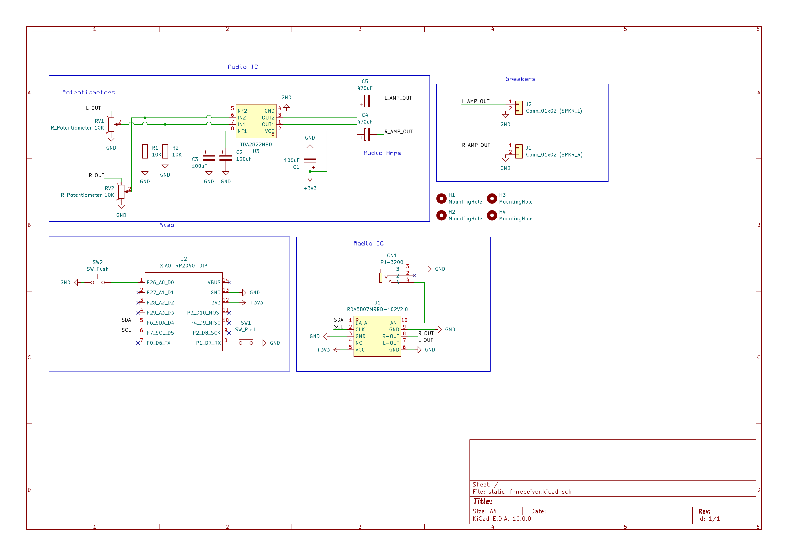

# static-fmradio-receiver
I have given up on unique hardware project names

## Schematic

## BOM
Things in the kit (for my own reference)
- 1 x Seeed Studio Xiao RP2040
- 2 x RDA5807 Module
- 2 x 10K WH148 Dual Gang Potentiometer
- 2 x 12mm Momentary Push Button
- 2 x Audio Jack
- 2 x TDA2822 Amplifiers
- 1 x 3.5mm Antenna
- 10 x 5mm LEDs
- 10 x M2.5 Screws
- 10 x M2.5 Heat Inserts, OD 3.5mm
- 10 x 100uF Capacitors
- 10 x 10K Resistors

|Qty|Name|
|---|---|
|john|hard|

## Inspirations
"Diy radio kit"

